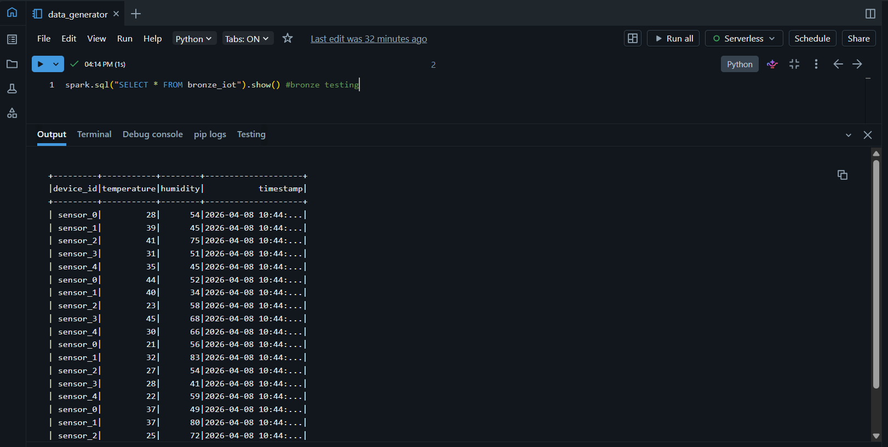
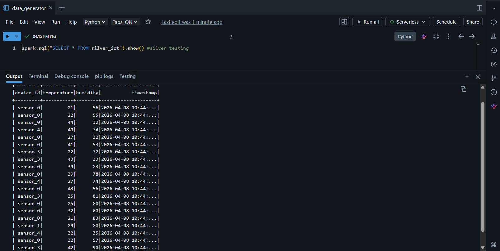
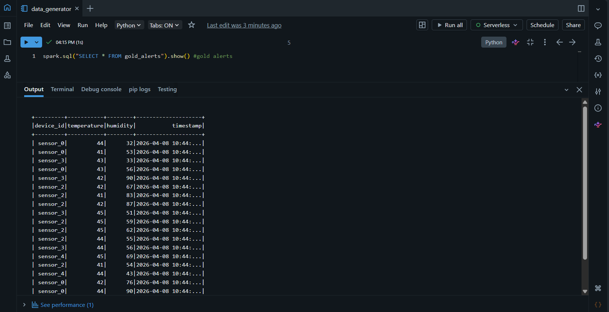

# IoT Data Lakehouse Pipeline

This project implements an end-to-end IoT data pipeline using PySpark and Delta Lake.

## Architecture
- Bronze: Raw data
- Silver: Cleaned data
- Gold: Aggregation, alerts, anomaly detection

## Tech Stack
- PySpark
- Databricks
- Delta Lake

## Screenshots

### Bronze Layer

### Silver Layer

### Gold Aggregation

### Alerts

### Visualization

